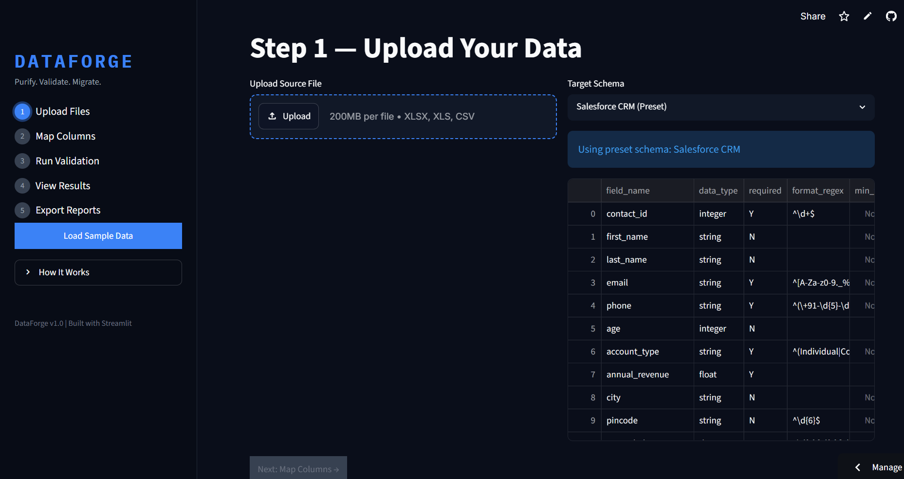
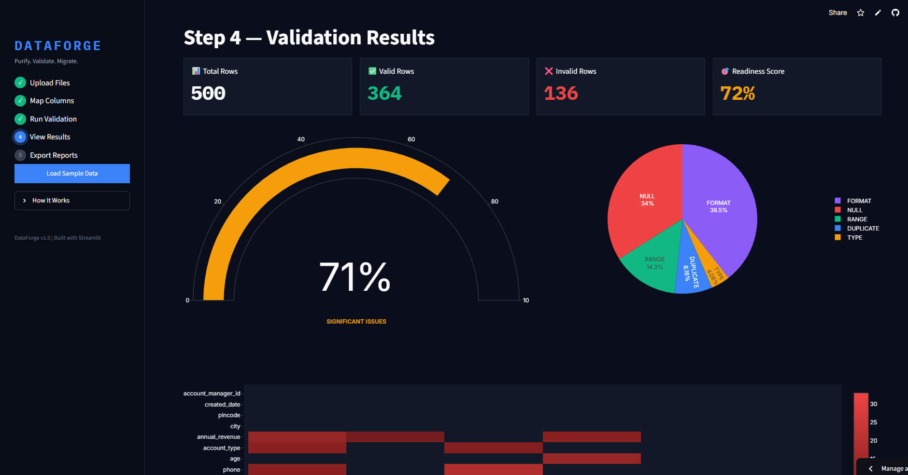
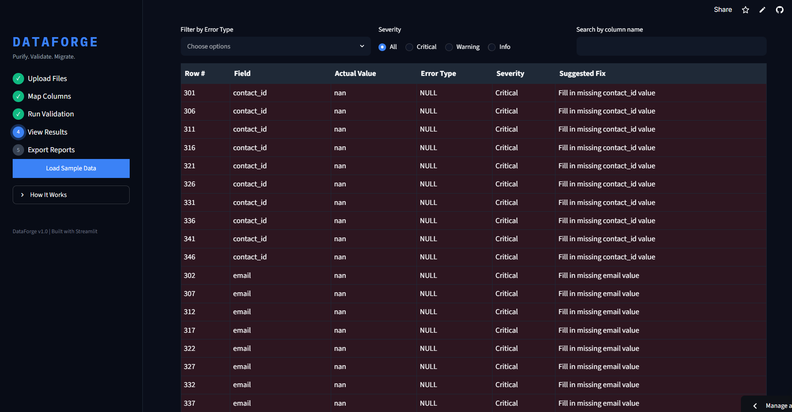
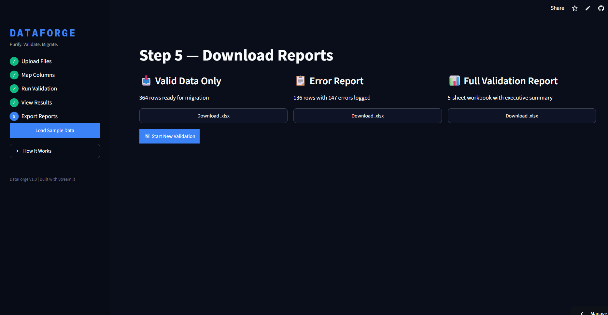

<div align="center">

# ⚡ DataForge
### Purify. Validate. Migrate.

A production-ready Enterprise Data Validation Platform built using Python + Streamlit.
Validates Excel/CSV datasets across 6 dimensions, scores migration readiness 0–100%,
and exports professional Excel reports — all in real time.

[](https://python.org)
[](https://streamlit.io)
[](https://pandas.pydata.org)
[](https://plotly.com)
[](LICENSE)
[](https://dataforge-yurthika.streamlit.app)

🚀 **[Try Live Demo](https://dataforge-yurthika.streamlit.app)** — Click "Load Sample Data", no upload needed.

</div>

---

## 📖 About The Project

DataForge solves a real enterprise problem — organizations push dirty data into Salesforce or databases without quality checks, causing costly migration failures.

DataForge provides a guided 5-step pipeline to detect errors, score data quality, and export clean migration-ready files before a single row moves to production.
Upload File → Map Columns → Run Validation → View Dashboard → Export Reports

---

## 💼 Business Value

DataForge helps organizations:

- Detect data quality issues **before** they reach production systems
- Reduce CRM migration failures caused by dirty or inconsistent data
- Replace days of manual validation with an automated pipeline
- Generate executive-ready reports for stakeholder review
- Increase migration success rates with a clear readiness score

---

## 📸 Screenshots

### 🏠 Upload & Schema Selection


### 📊 Validation Results Dashboard


### 📋 Error Details Table


### 📥 Export Reports


---

## ✨ Features

### 📁 Smart File Upload
- Accepts `.xlsx` `.xls` `.csv` up to 200MB
- Auto-detects column names and data types on upload
- Instant preview with row count, column count and file size
- Built-in Salesforce CRM preset schema — no schema file needed

### 🔗 Fuzzy Column Mapping
- Auto-maps source columns to target fields using `difflib.SequenceMatcher`
- Confidence score per mapping — green > 80% · yellow 50–80% · red < 50%
- Required vs optional field badges
- Blocks progression until all required fields are mapped

### ⚙️ 6-Dimension Validation Engine

| Rule | What It Catches |
|------|----------------|
| **Null** | Missing values in required fields |
| **Type** | Text in numeric fields, wrong data types |
| **Format** | Invalid emails, phones, pincodes, date formats |
| **Range** | Age outside 18–65, negative revenue values |
| **Duplicate** | Repeated primary key values |
| **Reference** | Foreign keys not found in master table |

Every error includes: row number · column · actual value · severity · suggested fix

### 📊 Analytics Dashboard
- KPI cards — Total · Valid · Invalid rows · Readiness Score
- Animated circular gauge with color-coded score bands
- Error breakdown pie chart across all 6 error types
- Column × error type heatmap
- Filterable paginated error table with severity color coding
- Top 5 fix suggestions ranked by score improvement %

### 📥 Excel Export Reports

| Export | Contents |
|--------|----------|
| **Valid Data** | Clean rows ready for migration — green styled header |
| **Error Report** | Invalid rows with cell-level red highlighting |
| **Full Report** | 5-sheet workbook — Executive Summary · Valid Data · Error Log · Column Matrix · Fix Recommendations |

---

## 📈 Project Highlights

- Processes datasets up to **200MB**
- Validates across **6 error dimensions** in a single run
- Detects errors at **cell level** with row-specific suggestions
- Generates **3 downloadable Excel reports** per validation run
- Scores migration readiness on a **weighted 0–100% scale**
- Processes **10,000 rows in under 8 seconds**

---

## 🏗 Architecture
┌─────────────────────────────────────────┐
│           app.py  —  Streamlit UI        │
│   5-step flow via st.session_state       │
└──────────────────┬──────────────────────┘
│
┌───────────▼───────────┐
│      DataLoader        │  ← Parses Excel / CSV
└───────────┬───────────┘
│
┌───────────▼───────────┐
│     SchemaMapper       │  ← Fuzzy column mapping
└───────────┬───────────┘
│
┌───────────▼───────────┐
│   ValidationEngine     │  ← 6 rule checks
└───────────┬───────────┘
│
┌───────────▼───────────┐
│    ReadinessScorer     │  ← Weighted 0–100 score
└───────────┬───────────┘
│
┌───────────▼───────────┐
│    ReportGenerator     │  ← 3 Excel exports
└───────────────────────┘

---

## 🛠 Tech Stack

**Application**
- Python 3.10+
- Streamlit

**Data Processing**
- Pandas
- NumPy

**Charts**
- Plotly Express
- Plotly Graph Objects

**Excel I/O**
- openpyxl
- xlsxwriter

**Validation**
- Custom Python class-based rules engine

**Sample Data**
- Faker `en_IN` locale

**Deployment**
- Streamlit Cloud

---

## 📂 Project Structure
dataforge/
│
├── app.py
├── core/
│   ├── validator.py              # 6-rule validation engine
│   ├── schema_mapper.py          # Fuzzy column mapping
│   ├── scorer.py                 # Readiness score calculator
│   └── report_generator.py      # Excel report builder
├── utils/
│   ├── data_loader.py            # File parsing
│   └── sample_data_generator.py # Demo dataset generator
├── ui/
│   ├── styles.py                 # Custom CSS
│   ├── sidebar.py                # Sidebar navigation
│   └── dashboard.py             # Chart components
└── sample_data/
├── sample_source.xlsx        # 500-row demo dataset
└── sample_schema.xlsx        # Salesforce schema template

---

## 🧪 Sample Dataset

500 realistic Indian CRM records with **~155 intentionally injected errors** across 12 columns.

| Error Type | Count |
|------------|-------|
| Null values | 47 |
| Duplicate IDs | 23 |
| Malformed emails | 31 |
| Invalid phone format | 18 |
| Out-of-range age | 12 |
| Type mismatches | 9 |
| Referential integrity failures | 15 |

Expected Readiness Score → **~65%**

---

## ⚙️ Installation & Setup

**Clone Repository**
```bash
git clone https://github.com/Yurthika/dataforge.git
```

**Navigate to Project Directory**
```bash
cd dataforge
```

**Install Dependencies**
```bash
pip install -r requirements.txt
```

**Generate Sample Data**
```bash
python utils/sample_data_generator.py
```

**Run Application**
```bash
python -m streamlit run app.py
```

Open `http://localhost:8501` in your browser.

---

## 🚀 Future Enhancements

- AI-powered fix suggestions using LLMs
- Salesforce direct API push after validation
- Multi-file batch validation
- Custom rule builder UI
- PDF report export
- Database schema support (PostgreSQL, MySQL)

---

## 👩‍💻 Author

**Yurthika Bodepudi**

[](https://github.com/Yurthika)

---

## ⭐ Support

If you found this project useful, please consider giving it a ⭐ on GitHub.